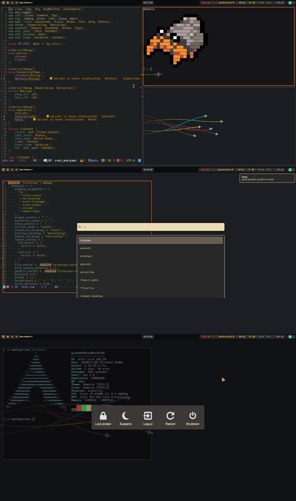

## Dotfiles
My dot files for arch/sway desktop.

---

---
#### Configurations for
- neovim
- alacritty  
- nwg-launchers   
- fuzzel
- bash
- mako
- starship
- tmux
- xkb
- fish
- mpd
- sway
- vifm
- zathura
- gdb
- swaylock
- waybar
- zsh
-----

### Installation
`stow` is required to install automatically, or manually install it by placing configurations in specific directories.

To install everything run `./install.sh`. If you want to install specific config run `stow <directory>`
